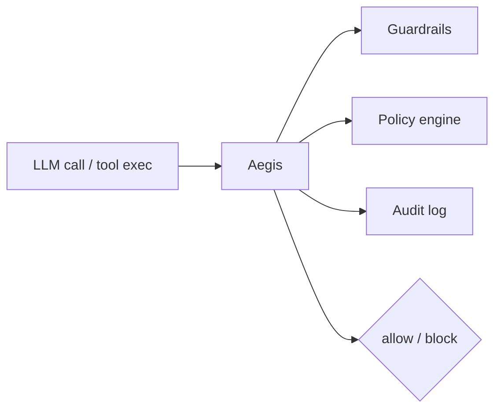

# Acacian

     

> **Backend engineer — reliable, secure infrastructure for AI systems**
> distributed reliability · data consistency · runtime correctness, security & cost accuracy for LLM / agent platforms

🌍 **Based in South Korea — open to global roles (remote or relocation)**

🇰🇷 한국어 소개

대규모 서비스 환경에서 **신뢰성과 데이터 정합성**을 고려한 백엔드를 설계하고,
**LLM/에이전트 플랫폼의 런타임 정확성·보안·비용**을 다룹니다. 리모트·이주 모두 가능하며 글로벌 포지션을 찾고 있습니다.

---

## 🛡 Built — Aegis, runtime security for AI agents

 · [github.com/Acacian/aegis](https://github.com/Acacian/aegis)

Solo-designed Python library that enforces guardrails, a policy engine, and audit logging on every LLM call and tool execution — at the CI/CD layer. Auto-instruments 12 AI frameworks (LangChain, CrewAI, OpenAI, Anthropic, LiteLLM, Google ADK …).

Integrates as a third-party guardrail provider for Pydantic AI and LiteLLM · listed in [awesome-mcp-servers](https://github.com/punkpeye/awesome-mcp-servers) and [Awesome-LM-SSP](https://github.com/CryptoAILab/Awesome-LM-SSP).

## 🔧 Contributing to AI-infra OSS

Fixing real correctness & cost bugs in the tools I use in production:
- **litellm** — bill xAI from its reported cost instead of stale recomputation ([#36281](https://github.com/BerriAI/litellm/pull/36281))
- **Spring AI** — DeepSeek tool-call `content=null` fallback ([#3817](https://github.com/spring-projects/spring-ai/pull/3817)) · RedisVectorStore `BuilderCustomizer` ([#3809](https://github.com/spring-projects/spring-ai/pull/3809))

## 🏗 Current work

In production today — backend for an enterprise **LLM gateway / AI-security platform** (Soosan): proxy request lifecycle, DLP and guardrail enforcement, cross-provider correctness, policy & audit paths, load and reliability testing.

## 📦 Also shipped

**CandyPod** — backend engineer on a mobile matching app, live on the App Store and Google Play.

## 🎯 Focus

`distributed reliability` · `fault isolation & recovery` · `data consistency` · `LLM / agent runtime security` · `cross-provider correctness & cost accuracy` · `AI-native system design`

## 💼 Experience

**Soosan** (current) · **Koosstech** — Backend & DevOps (E2E ownership) · **MementoAI** — Backend (intern) · **ROK Air Force** — mission-critical systems operations

Earlier: **PassionPay** — MSA fintech payments platform (lead), payment-service architecture & consistency design.

## ✍️ Writing · 📫 Contact

Tech blog → https://victorica.tistory.com/ &nbsp;·&nbsp; 📧 koo9811@naver.com &nbsp;·&nbsp; 💼 [linkedin.com/in/otkling](https://linkedin.com/in/otkling)
